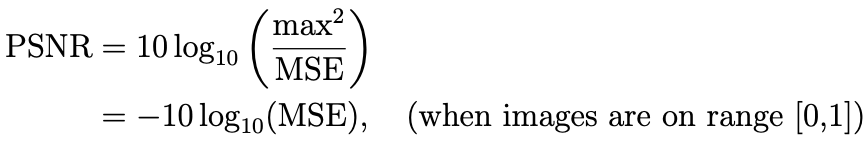
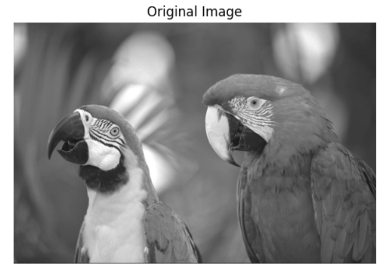
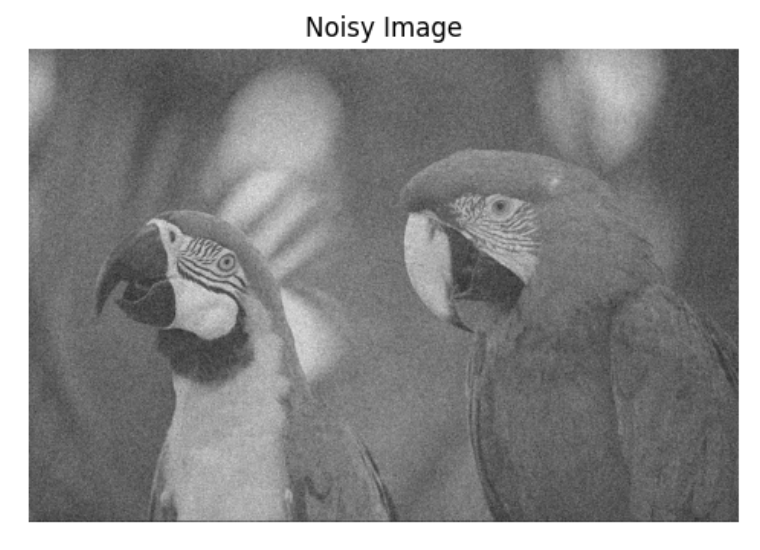
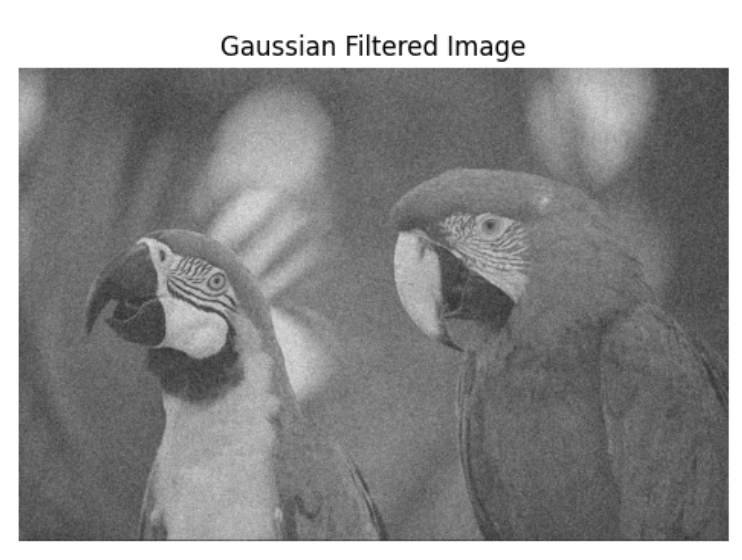
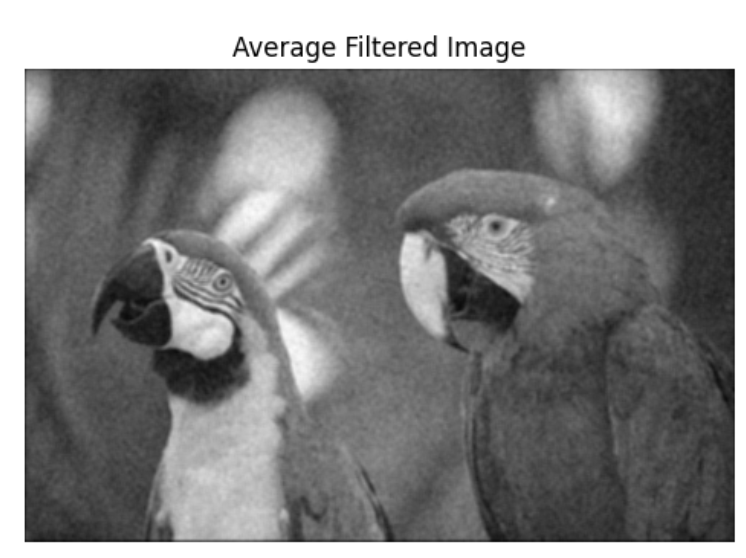
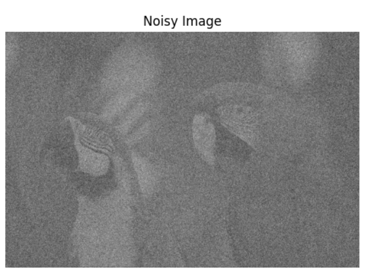
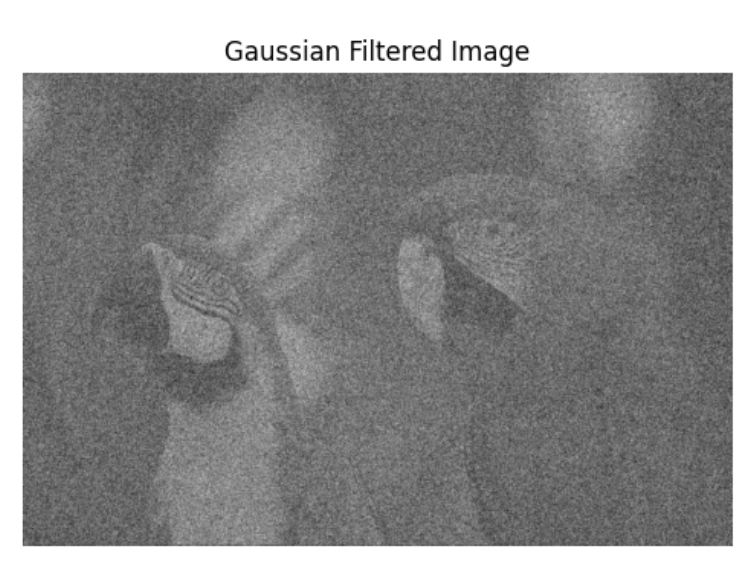
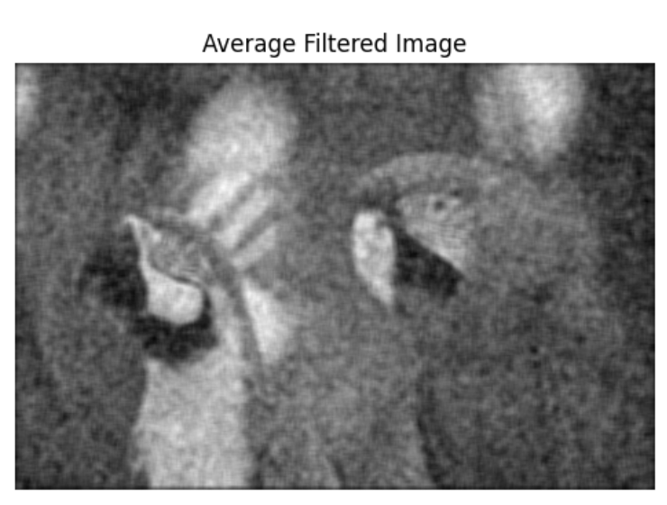

# Image Denoising with Average and Gaussian Filters

This project involves adding noise to an image and comparing different filtering methods to remove the noise and evaluates their performance quantitatively using PSNR.

First, we implement a function which takes in an input image and noise-level sigma, and adds i.i.d zero-mean Gaussian random noise with standard-deviation sigma.

Next, we write a function which returns a 2D Gaussian filter of size m × m with standard deviation σ, where m = ⌈5σ⌉. We normalize the filter to sum to 1 so that filtering does not shift the mean of the image.

Finally, we generate a noisy version of the image with a noise-level σ = 0.1 on an image intensity scale of [0, 1]. We apply separately a Gaussian filter of size 5 × 5 and average-filter of size 5 × 5 and compare their noise-removal qualitatively. We repeat this for a few different noise-levels and filter sizes, and calculate the PSNR of the noisy and denoised images via the formula:

Here are some examples:

**With Kernel Size = 5, Noisy image with noise level = 0.1:**

PSNR =  19.99367622253457

**Denoised image with gaussian filter 5x5:**

PSNR =  19.99367622253457

**Denoised image with average filter 5x5:**

PSNR =  28.161498016975457

**With Kernel Size = 9, Noisy image with noise level = 0.45:**

PSNR =  6.924575611488234

**Denoised image with gaussian filter 9x9:**

PSNR =  9.520911003260869

**Denoised image with average filter 9x9:**

PSNR =  23.460656434489717
